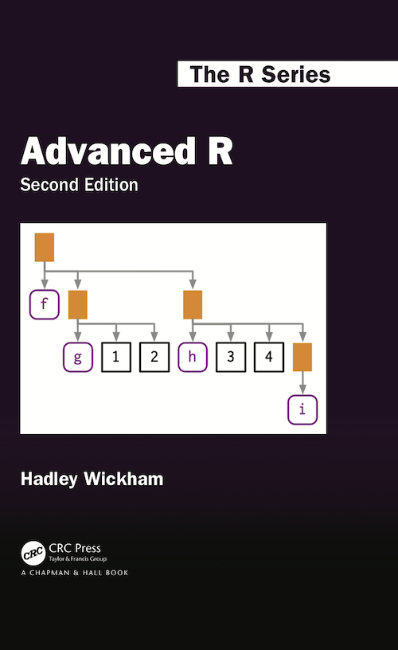
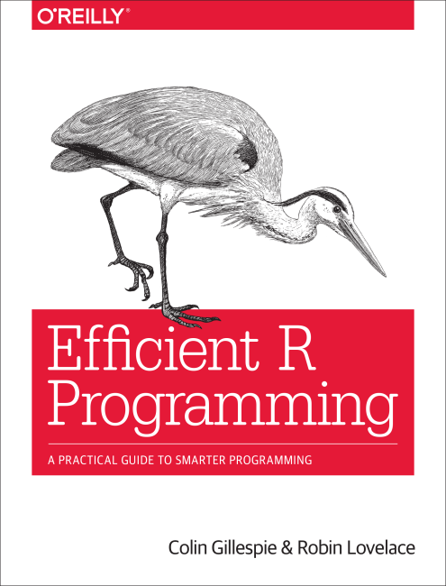
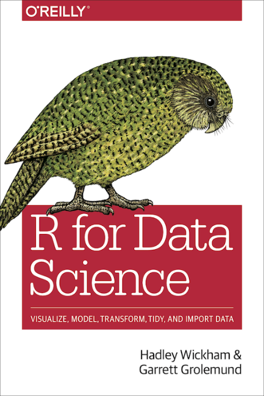

# Introduction

This webinar is aimed at people who are familiar with the basics of R programming (e.g. the syntax, variable types etc.), and who want to understand and write better R code. It will cover some, but by no means all aspects of efficient R programming for data analysis - for more in-detail approach, refer to the reading materials at the end of this document.  

After this webinar you will (hopefully) understand better how R works and why some things that are slow are slow, and how to make them faster. We will cover the most important aspects of efficient programming in R, like functions and functionals, control flow statements, loops and parallelization. In the end you will see several general and easy tips you should have in mind if you want your code to be faster, so stay motivated till the end.

Happy learning!

# Setup

If needed, install the packages that will be used in this webinar.

```{r warning=FALSE, message=FALSE}
packages <- c("lobstr","data.table","microbenchmark","parallel","foreach","doParallel")
for (pkg in packages) {
  if (!requireNamespace(pkg, quietly = TRUE))
    install.packages(pkg)
}
```

Load the packages.

```{r warning=FALSE, message=FALSE}
library(lobstr)
library(data.table)
library(microbenchmark)
library(parallel)
library(foreach)
library(doParallel)
```

# Variable binding

If you followed our introductory R webinar, you know how to create objects of different data types in R, and how to assign them to variables. 
For example, here we create an integer vector `c(1,2,3)` and assign it to the variable called `v1`. This varaible is now stored somewhere in memory, and we can then find its address.

```{r}
v1 <- c(1,2,3)
require(lobstr)
obj_addr(v1)
```

If we modify the object we just created, what actually happens (in most of the cases) is that the object gets copied, and the copy is modified, while the original is unchanged.

```{r}
v1[1] <- 0
obj_addr(v1)
```

The address of the modified object is different from the original one. This **copy-on-modify** behavior can, in case of large objects, slow down the code execution and quickly use up the available memory. To avoid this, we need to understand why and how exactly it happens.  

When we created `v1`, what actually happened is that we created an integer vector and assigned it to a name `v1` - not the other way around! Even though we write the left-facing assignment arrow, pointing from object to the variable name, what actually happens is the opposite - the name is a pointer (or a reference) to the object.

```
v1 -> c(1,2,3)
```

> The object (or value) doesn't have a name, it is actually the name that has a value.

This subtle difference has important implications. First one is that assigning the same object to different variables doesn't create any copies. This is shown in the example below, where we assign previously created vector `v1` to another variable, `v2`.

```{r}
v2 <- v1
obj_addr(v1)
obj_addr(v2)
```

You can see that the address is the same. It's only once this object is changed that it gets copied, as we've seen above.  

It's not just variables that that are pointers to the actual values - the elements of the lists are, too. This leads to the second important implications of reference binding in R, illustrated by the following example.

```{r}
l1 <- list(1,2,3)
l2 <- l1
l2[[1]] <- 0
ref(l1,l2)
```

If  we create the following list `l1`, and then modify it, we see that the address of the object is changed, i.e. it is copied, but the unchanged elements have the same addresses as before. This is because the created copy is a **shallow copy**, meaning that the list object and its bindings are copied, but the values pointed to by the bindings are not. 
This is actually a very useful concept that was first introduced in R 3.1.0 (before that, all copies were deep copies, which was more memory inefficient). Since the elements of lists are references to values, the size of a list might be much smaller than you expect. Take the following example.

```{r}
x <- runif(1e6)
y <- list(x1=x,x2=x,x3=x)
obj_size(x)
obj_size(y)
ref(y)
```

The difference in the size of a vector of million random numbers and a list that contains this vector repeated three times is not three times bigger, as you might expect, because the list only contains pointers to the same vector.  

Another extension of this are data frames. Look at the following example.

```{r}
d1 <- data.frame(x=c(1,2,3), y=c(4,5,6))
d1
```

Because data frames are lists of columns, modifying value in column will only copy that single column, whereas modifying a row requires copying all the columns. 

```{r}
d2 <- d1
d2[,1] <- d2[,1]+3
ref(d1,d2)
d3 <- d1
d3[1,] <- d3[1,]+1
ref(d1,d3)
```

The similar is true for character vectors - repeating a character vector 100 times does not increase its size 100 times, and this is because character vectors are pointers to unique strings in a global string pool.

```{r}
ch <- "character"
obj_size(ch)
obj_size(rep(ch,100))
ref(rep(ch,2), character=TRUE)
```

So, R will in principle copy most of the objects when you modify them - and this will take time and memory, especially for large objects. However, list and columns in data frame, which essentially are lists, as well as character vectors, contain elements which are just pointers to the actual values and will only make shallow copies. Therefore the size of lists and character vectors does not scale linearly when elements within them are pointers to the same values.

There are several exceptions from general copy-on-modify behavior. Most notably, environments and objects with single bindings get modified without copying (modify-in-place), as well as objects of specific classes implemented in additional packages, such as `data.table`, illustrated below. This can lead to significant performance improvements, especially when working with large objects, but is out of scope of this webinar.

```{r}
dt <- data.table::setDT(d1)
dt[,x:=x+1]
ref(d1,dt)
```

Pause for thought: remember the vector we created at the beginning `v1 <- c(1,2,3)`? Then we modified it, which now you know means that R made a copy of it and moved the pointer `v1` to the new vector `v1 <- c(0,2,3)`. What do you think happened to the `c(1,2,3)` which is now without a name?

It would be very bad of R to keep this type of objects in memory, that's why there is a **garbage collector (GC)** that runs in the background and frees up the memory by removing these kind of objects without any bindings. While this is very good, memory wise, it still takes up computing resources and affects the speed of code execution - therefore, take home message: best to avoid making R make copies altogether!

# Functions

## Functional programming

Most programming languages can be labeled as either **object-oriented programming** (OOP) or **functional** languages. What does that mean? Simply speaking, in object-oriented languages, the main building blocks are the objects, and everything is treated as an object (variables, methods, etc). On the other hand, in functional programming languages, or in a functional style of programming, functions can be treated as data structures, i.e. they can be assigned to variables, stored in lists, passed as arguments to other functions or returned as output of other functions (this type of functions is called first-class functions).  

While in R we can do both object-oriented and functional programming, at it's core, it is (closer to) a functional programming language (there are some technicalities in the definition of a functional programming language that R doesn't satisfy, but that's not important at this level).  

> Functional programming in R is much more important than object-oriented programming, because you typically solve complex problems by decomposing them into simple functions, not simple objects.  

## Writing a function

Functions allow you to automate common tasks in a more powerful and general way than copy-pasting your code. Writing a function has several advantages:  

* having a code that does something in one place, rather than in several, makes your code easier to read
* and as requirements change, you only need to update code in one place, instead of many
* properly named functions also make your code easier to understand
* you eliminate the chance of making incidental mistakes when you copy and paste (i.e. updating a variable name in one place, but not in another)

Functions are important aspect of a **“do not repeat yourself” (DRY) principle**. The more repetition you have in your code, the more places you need to remember to update when things change (and they always do!), and the more likely you are to create bugs over time.

A good function, in any programming language, should do one thing only, and do it well.  
Let's start by writing a simple function that adds two numbers.

```{r}
addition <- function(x, y) x + y
```

A function has four main parts, one of which is optional:

* name, which can be omitted
* arguments that are passed as input to the function  
* body of the function, i.e. the code that determines what the function does  
* environment that determines how the function finds the values associated with the names  

The arguments and body are specified explicitly when you write a function, but the environment is specified implicitly, based on where the function was defined - right now, and for most functions you will probably write, this will be the global environment, but functions can also be defined elsewhere, e.g. in the packages.  
Here we assigned a name to the function, but we could also write an anonymous function - there are cases when this is useful (e.g. functionals) but more on that later.
Also,  the function can in principle take no arguments - there is no much point in it them, but we will use functions without arguments to illustrate some examples in this webinar.
Finally, a function output is whatever was last evaluated in the function body, but it can also be specified implicitly.

```{r}
addition <- function(x, y) {
  z <- x + y
  return(z)
}
```

We can now use our function to add two numbers. When calling the function, we can specify arguments either explicitly by name or implicitly by position. The former approach is generally safer, and it also allows us to change the order in which we are passing the arguments, but for some functions which are used often, it is ok and understandable not to name the arguments.

```{r}
addition(x=1, y=2)
addition(1, 2)
addition(y=2, x=2)
```

In the case of the function we just wrote, we always need to pass it both of the defined arguments. It is also possible to define a default value for any of the arguments, and the we can call the function without specifying the value for that argument.

```{r}
increment <- function(x, y=1) {
  x + y
}
increment(x=2)
increment(x=2, y=2)
```

A special type of argument that can be passed to a function is `...` (pronounced dot-dot-dot). With it, a function can take any number of additional arguments. `...` is useful if your function is internally calling another function, and you want a neat way to pass additional arguments to internal function, without copy-pasting them all in your function definition.  

For example, we define a function that calculates logarithm of the ratio of its two arguments.

```{r}
logodds <- function(x, y, ...) {
  log(x/y, ...)
}
logodds(2,3, base=10)
```

The function is internally using `log()` function which can also take `base` argument, determining the base of the logarithm to calculate. Rather than explicitly specifying this argument in our function definition, we can use `...` instead - it may seem not very helpful now, but if the internally used function could take more arguments, we could simply reuse them all, instead of specifying them one by one in our `logodds()` function definition.

Now that you know how to write a function in R, we can look at how R executes our function calls.

## Scoping

Earlier we discussed variable binding and the importance of knowing how a name is bound to a value in R when you create variables.  
To understand functions, it is also important to understand how the opposite is done in R, i.e. how the value is associated with a name passed to the function as an argument. This process is called scoping.

R uses so-called **lexical scoping** - this means that it looks up the values of arguments' names based on how a function is defined, not how it is called. There are four main rules that define lexical scoping.

### 1. Names defined inside a function mask names defined outside a function.

R first looks for a name defined inside a function.

```{r}
x <- 10
f1 <- function() {
  x <- 1
  return(x)
}
f1()
```

If a name is not defined inside a function, R looks one level up, i.e. in the environment from which the function is called (usually global environment). Finally, it looks in other loaded packages.

```{r}
f1 <- function() {
  x
}
f1()
```

### 2. Execution enviroment

Every time a function is called a new environment is created to host its execution. The variables created in this environment are not available outside of it, after the function is executed.

```{r}
f2 <- function() {
  fa <- 1
  return(fa)
}
f2()
exists("fa")
```

Actually, there is a way to assign a variable to global environment from within the function environment, but this is not good practice because functions shouldn't have side effects, like creating or changing variables without explicit assignment.

### 3. Functions versus variables

Functions are ordinary objects in R, just like vectors and list, and the binding rules described earlier also apply to them. However, if a function and non-function object have the same name (they must be defined in different environments for this to be possible), R can still distinguishes the two.

```{r}
# function f3() defined in global environment
f3 <- function(x) x+1

f4 <- function(x) {
  # integer object f3 defined in function environment
  f3 <- 10
  
  # R looks for a function f3() and a non-function f3
  f3(f3)
}

f4()
```

It's pretty cool that R can distinguish this, but bst practice is still to avoid using common function names for your variables - e.g. don't name your variables `log`, `sum`, `sqrt`, `print` or `plot`.

### 4. Dynamic lookup

Lexical scoping determines where, but not when to look for values. R looks for values when the function is run, not when the function is created. This means that the output of a function can differ depending on the objects outside the function’s environment.

```{r}
x <- 15
f4 <- function() x + 1
f4()
x <- 20
f4()
```

This is related to another important principle of R code evaluation that we cover next.

## Lazy evaluation

{width=50%}

Another important property of how functions work in R is lazy evaluation. This means that arguments are evaluated only if they are accessed by the function body.

```{r}
f5 <- function(x, y) x
f5(x=10, y=rubbish)
```

If `rubbish` was evaluated, we would get an error, because we never defined this variable, but the function never attempts to do this, and therefore it works.

*** 
To sum up, function evaluation is guided by several principles, termed lexical scoping and lazy evaluation - most important to remember is that the variables you pass to functions are first looked for within the function definition, and only after that in global environment, and that they are only looked up once the body of the function tries to access them. Also, whatever variables and bindings you create inside a functions, they are enclosed in an isolated environment and can not (or should not) be visible from outside of function, i.e. your global environment).  

Now that you understand how functions are being evaluated in R, we will also mention another important tool you need to know when writing your functions, and this is how to exit them with informative messages for the users when the function can;t be completed.

## Exiting a function

If a function cannot be completed, it  should return an error message.

```{r error=TRUE}
f6 <- function(x) {
  if (!is.numeric(x)) 
    stop("x is not numeric!")
  return(x)
}
f6("word")
```

(We will cover if-else syntax in the next section!)  

The function can also output two different types of diagnostic messages, messages and warnings. Unlike when using `stop()`, these don't interrupt the function execution.

```{r error=TRUE}
f7 <- function(x) {
  if (!is.numeric(x)) {
    warning("x is not numeric, returning random x")
    x <- runif(1)
  } else
    message("returnig input x")
  return(x)
}
f7(1)
f7("word")
```

# Control flow

Next topic we will cover is control flow. In programming in general, control flow refer to the order on which code statements (such as variable assignments, function calls etc) are executed. There are two main ways to control the flow of execution in R: choices and loops. Choices, like `if` statements and `switch()` calls, allow you to run different code depending on input values. Loops, like `for` and `while`, allow you to repeatedly run code, typically with changing options.

## Choices
### `if`

If statements in R have the following syntax:

```
if (condition) true_action
if (condition) true_action else false_action
```

We can reuse the example we saw in the previous section.

```{r}
f7 <- function(x) {
  
  if (!is.numeric(x)) {
    
    warning("x is not numeric, returning random x")
    x <- runif(1)
  
  } else {
  
    message("returnig input x")
  
  }
  
  return(x)
}
```

The condition should always evaluate to a single `TRUE` or `FALSE`; if it doesn't, R will attempt to convert it to logical, be careful with this! For example, all integers except 0 will be converted to `TRUE`, and 0 to `FALSE`, but for characters this will produce `NA` and generate error.

```{r error=TRUE}
val <- 10
if (val) print(val) else print("No input")

val <- "val"
if (val) print(val) else print("No input")
```

Think about the following examples - what would be returned in each case?

```{r eval=FALSE}
x <- 1:10
if (length(x)) "not empty" else "empty"

x <- numeric()
if (length(x)) "not empty" else "empty"
```

If condition evaluates to a logical vector of length greater than 1, only the first argument will be used, and we will get a warning.

```{r warning=TRUE}
val <- c(10,20)
if (val) print(val) else print("No input")
```

In practice, this is usually not what you intended, and that's why in R 3.5.0 and greater you can choose to turn this warning into an error by setting an environment variable:

```{r eval=FALSE}
Sys.setenv("_R_CHECK_LENGTH_1_CONDITION_" = "true")
```

### `ifelse`

This is a vectored version of `if` statement. It has the following syntax:

```
ifelse(condition, yes, no)
```

Here's an example of `ifelse` statement. 

```{r}
x <- 1:5
ifelse(x < 3, "less", "greater or equal")
```

The resulting value is a vector of the same length as the `condition`.  

You should really only use `ifelse()` when the `yes` and `no` vectors are the same type, because otherwise R will try to coerce the output, and this may produce unexpected results and will not throw an error.  

```{r}
x <- 1:5
ifelse(x < 3, x, "greater or equal")
```

Think about the following example - what do you expect it will return?

```{r eval=FALSE}
x <- length(numeric())
ifelse(x, 1:10, 11:20)
```

Be careful to meet `ifelse`'s requirements!  

### `switch`

Switch is a compact equivalent to if statement. Consider the following example:

```{r}
x <- "a"
if (x == "a") {
  "option 1"
} else if (x == "b") {
  "option 2" 
} else if (x == "c") {
  "option 3"
} else {
  stop("Invalid `x` value")
}
```

The same thing could be written more compactly using `switch()`

```{r}
switch(x,
  a = "option 1",
  b = "option 2",
  c = "option 3",
  stop("Invalid `x` value")
)
```

`switch()` is implemented according to the same function in C, and it has an interesting propagation property. Consider this example - how do you think it would work?

```{r eval=FALSE}
switch(x,
  a = ,
  b = "option 1",
  c = "option 2",
  stop("Invalid `x` value")
)
```

Note that the last option in `switch()` statement should always throw an error, otherwise unmatched inputs will return `NULL` invisibly, and this unaccounted for behavior might cause problems.

```{r}
switch("c", a = 1, b = 2)
```

***

Now that we've covered `if()`, `ifelse()` and `switch()` conditions in R that we can use to *conditionally* execute parts of code, we turn to the next group of operators that control execution flow by allowing us to *repeatedly* execute some parts of code, and these are loops.

## Loops

Loops generally have a bad reputation in R, and at some point when you started learning R, you were very likely taught to avoid them. So why do we even mention them? Well, because loops are not necessarily always slow, and they are not slow *per se* - rather, they are flexible. It is the under-the-hood behavior of R that makes them slow, such as copying-on-modifying that we discussed before. Once you understand this, you can get away with writing a fairly decently performing loops.

### `for`

`for` loops are used to iterate over items in a vector (or list). They have the following basic form:

```
for (item in vector) perform_action
```

A simple example:

```{r}
for (i in 1:3) {
  print(i)
}
```

The `item` is given explicitly and is not looked up in the global environment, or anywhere else.  
However, the code inside the loop will assign and overwrite variables in global environment in each iteration (unlike functions, which are evaluated in an isolated environment, as we mentioned before).

```{r}
i <- 20
for (i in 1:3) {
  print(i)
}
i
```

There are two ways to terminate a for loop early:

* `next` exits the current iteration
* `break` exits the entire `for` loop

```{r}
for (i in 1:10) {
  if (i < 3) 
    next

  print(i)
  
  if (i >= 5)
    break
}
```

Usually you will want to save the output of the each loop iteration, maybe to a list, like this.

```{r eval=FALSE}
out <- list()
for (i in 1:1e5) {
  out[[i]] <- runif(1000)
}
```

This is actually not a good way to do it, because whenever you add additional element to a list, or use `c()`, `append()`, or a similar function to create a bigger object, R must first allocate space for the new object and then copy the old object to its new home. If you’re repeating this many times, like in a for loop, this can be quite expensive, and R spends most of the time allocating and freeing up the memory, rather than doing calculations, and as a result, the loop will be very slow.
That's why you should pre-allocate the output container of final size.

```{r eval=FALSE}
out <- vector("list", 1e5)
for (i in 1:1e5) {
  out[[i]] <- runif(1000)
}
```

We can check the time it takes for each of the two versions to finish by wrapping them within `microbenchmark()`.

### `while` and `repeat`

`for` loops are useful if you know in advance the set of values that you want to iterate over. If you don’t know, there are two related tools with more flexible specifications:

* `while(condition) action` performs action while condition is `TRUE`

```{r}
i <- 1
while (i < 5) {
  i <- i + 1
  print(i)
}
```

* `repeat(action)` repeats action until it encounters `break`, it needs to be combined with condition statements we saw before

```{r}
i <- 1
repeat({
  i <- i + 1
  print(i)
  if (i == 5) break
})
```

You can rewrite any `for` loop to use `while` instead, and you can rewrite any `while` loop to use `repeat`, but not the other way around. That means that, in term of flexibility

`repeat` > `while` > `for` 

It’s good practice, however, to use the least-flexible solution to a problem, because this implies least thing that R needs to spend time inferring. This is also why you should always use functionals instead of loops, as everyone will probably tell you. We will cover them in the next section.

# Functionals

A function that takes another function as an argument is called functional.
We have already seen an example of a functional when we wrote a function that calculates log odds ratio.
A common use of functionals is as an alternative to `for` loops.

In base R there are several functionals with specialized functions that are meant to be a better alternative for loops:
* `apply()` is specialized to work with two-dimensional and higher vectors, i.e. matrices and arrays
* `lapply()` and related `sapply()` can be used to iterate over one-dimensional vector elements

### `apply()`

You can think of `apply()` as an operation that summarizes a matrix or array by collapsing each row or column to a single value. It has four arguments:

`apply(X, MARGIN, FUN, ...)`

* `X`, the matrix or array to summarize
* `MARGIN`, an integer vector giving the dimensions to summarize over, 1 means rows, 2 means columns, and so on (higher values *n* are used in n-dimensional arrays to summarize over the *n*-th dimension)
* `FUN`, a summary function to be applied to selected dimension, i.e. each row or column etc.
* `...` any other arguments that can be passed on to `FUN`

Apply returns either a vector, a matrix or an array, each element of which is the result of applying `FUN` to the corresponding `MARGIN` of `X`. This is easiest to understand by looking at some examples:

```{r}
a2d <- matrix(1:20, nrow = 5)
a2d
apply(a2d, 1, mean)
apply(a2d, 1, function(x) x+1)
apply(a2d, 1:2, function(x) x+1)
a3d <- array(1:24, c(2, 3, 4))
a3d
apply(a3d, 1, mean)
apply(a3d, c(1,3), mean)
```

As tempting as it might seem, you should never use `apply()` with data frame, because it will be coerced to a matrix, which will lead to undesirable results if your data frame contains anything other than numbers.

### `lapply()`, `sapply()` and `vapply()`

`lapply()` is similar to `apply()`, it takes the following arguments:

`lapply(X, FUN, ...)`

* `X`, the vector or list with elements over which to iterate
* `FUN`, a function to be applied to elements of `X`
* `...` any other arguments passed on to `FUN`

`lapply()` returns a list of the same length as `X`, each element of which is the result of applying `FUN` to the corresponding element of `X`.
 
```{r}
v <- list(A=0:10, B=sample(1:100,10), C=runif(10))
lapply(X = v, FUN = mean)
```
 
`sapply()` works similarly, but it can additionally take two more logical arguments:

* `simplify` determines whether the output should be simplified to a vector, matrix or array, if possible (otherwise the output is always a list)
* `USE.NAMES` whether to preserve names of `X` in the output (if `X` had names to start with), or if `X` is character, to use it as names of the output list

```{r}
sapply(X = v, FUN = mean)
```

Generally, it's sometimes hard to predict the structure of the simplified output produced by `sapply()`, so it's safer to use `lapply()`. Another alternative is to use `vapply()`, which is similar to `sapply()`, but it has a pre-specified type of return value, so it can be safer (and sometimes faster) to use. With `vapply()` you specify the expected structure that each iteration of `FUN` needs to return - this is given as a `FUN.VALUE` argument, and the function will check that all values returned by applying `FUN` to elements of `X` are compatible with the `FUN.VALUE`, in that they must have the same length and type.

```{r}
fv <- vector(mode = "numeric", length = 1)
vapply(X = v, FUN = mean, FUN.VALUE = fv)

fv <- summary(v$A)
vapply(X = v, FUN = summary, FUN.VALUE = fv)
```

### `tapply()`

`tapply()` is similar to `lapply()`, but it lets you create a subset of a vector and then apply some functions to each of the subset (rather than each of the individual elements) of `X`. 

`tapply(X, INDEX, FUN, ...)`

* `INDEX` argument specifies groups of `X` - it should be a factor (or something that can be converted to factor) of the same length as `X`, withe the levels of the factor specifying different groups of data.

In the following example we generate a sequence of 100 random numbers, assing each to one of the three categories (A, B or C), and calculate per-category mean

```{r}
x <- runif(100)
y <- sample(LETTERS[1:3], 100, replace=TRUE)
tapply(x, y, mean)
```

### `mapply()`

You can think of `mapply()` as being a multivariate version of `sapply()` - it applies `FUN` to the first elements of each `...` argument, the second elements, the third elements, and so on. It also attempts to simplify output to an array, and, importantly, it recycles arguments, if necessary. Note that, since `...` is used to pass arguments over which to iterate, additional arguments to `FUN` are here passed as a list with `MoreArgs`.

```
mapply(FUN, ..., MoreArgs, SIMPLIFY, USE.NAMES)
```

An example:

```{r}
x <- 1:5
y <- 3:7
mapply(sum, x, y)
```

### `rapply()`

`rapply()` is a "recursive" version of `lapply()`.It applies `FUN` recursively on each element of the list that itself is not a list (therefore recursive) and the class of which is specified by `classes` argument. 

`how` parameter can either have a value `“replace”`, in which case each element of list to which the `FUN` is applied is replaced by the `FUN` output, and the other elements are kept as they are. If `how` is `“list”` or `“unlist”`, all non-list elements to which the `FUN` is applied are replaced by the `FUN` output and all others are replaced by the value specified with `deflt` argument; in case of `how="unlist"`, the `unlist(recursive=TRUE)` is called on the result.

```{r}
x <- list(A=runif(10), B=LETTERS[1:4], c=matrix(1:9,nrow=3))
x
rapply(x, mean, classes=c("integer","numeric"), how="replace")
rapply(x, mean, classes=c("integer","numeric"), how="list", deflt=NA)
rapply(x, mean, classes=c("integer","numeric"), how="unlist", deflt=NA)
```

***

Now we have explained what functionals exist in R and how they can be used to iterate in various specialized cases. Because they are very specific, they are usually faster than loops and you should generally use them instead of loops, when possible.  
Even  with functionals, you might find yourself frustrated at how slowly your R code runs if you perform heavy computations or analyze large data with many iterations. Luckily, there is another way that you can resort to, and this is parallelization that we cover next.

# Paralellization

The most brute-force approach to making your loops and functionals faster is of course to parallelize them. This means to allocate some computational resources to each iteration of the loop and then to calculate iterations simultaneously. Many problems in statistics and data science can be executed in an “embarrassingly parallel” way,because the different pieces of the problem never really have to communicate with each other (except perhaps at the end when all the results are assembled).

Here we introduce several different way in which you can run your code in parallel that are equivalent to serial functionals and loops we saw earlier.  

### `mclapply()`

A parallelized version of `lapply()` function is `mclapply()` in `parallel` package. 

```
mclapply(X, FUN, ..., mc.cores)
```

The first three arguments to `mclapply()` are exactly the same as for `lapply()`, and it has further arguments the names of which start with `mc`, and they specify how the function will be executed in parallel. Most important of these is `mc.cores` which specifies the number of processors/cores you want to split the computation across (this should be at most `detectCores()-1` i.e. number of available cores - 1).

```{r}
require(parallel)
v <- replicate(n=4, expr=rnorm(1e3), simplify=FALSE)
mclapply(v, mean, mc.cores=4)
```

Note that you can't use `mclapply` with `mc.cores` > 1 on Windows, because the underlying mechanism it uses to split processes (called forking) only works for UNIX-like systems.

One major difference between parallel implementation of `mclapply()` and sequential `lapply()` is that in the parallelized version, any of the independent iterations can fail with error, and the ones that were successfully calculated will still be returned in the results, while in serial functions all iterations need to finish without errors in order to get the result. 

```{r}
res <- mclapply(1:4, function(i) {
  if (i == 3L) 
    stop("error in this process!") 
  else 
    return("success!")
}, mc.cores = 4)
```

It is therefore important to inspect the results of `mclapply()`!

```{r}
lapply(res,class)
```

### `parLapply()`

Apart from forking that we just saw, another way to build a cluster using the multiple cores on your computer is via sockets. This will work both on Windows and UNIX-like operating systems. 

This approach is somewhat less straightforward because you need to explicitly start a cluster, export your variables and stop the cluster after calculation -`mclapply()` handles all of this for us internally.   

With the cluster created using sockets, you use `parLapply()` parallel equivalent of `lapply()` function, passing it the cluster object as the first argument.  

```
parLapply(cl, X, fun, ...)
```

```{r}
cl <- makeCluster(4)
clusterExport(cl, "v")
parLapply(cl=cl, X=v, fun=mean)
stopCluster(cl)
```

***

These are the two ways to make your `lapply()` and friends functionals parallel (check out also `parApply()`,`parSapply()`).  
Next we look at how to run loops in parallel.

### `foreach %dopar%`

Parallel implementation of loops is provided in the two R packages, `foreach` and `doParallel`, where `foreach` provides the (sequential) looping functionalities, and `doParallel` acts as an interface between `foreach` and the `parallel` package we saw earlier.

```{r}
require(foreach)
require(doParallel)
```

In this approach, you can register cluster using any of the two ways we saw earlier - either explicitly using sockets...

```{r}
cl <- makeCluster(4)
registerDoParallel(cl)
foreach(i=v) %dopar% mean(i)
stopCluster(cl)
```

...or forking implicitly and only specifying the number of cores.

```{r}
registerDoParallel(cores=2)
foreach(i=v) %dopar% mean(i)
```

The syntax of parallel loop is petty straight forward. Apart from looping like a regular `for`, and because it is a function, `foreach` outputs its results - you don't need pre-allocated object to save them to, you just assign it to a variable. `foreach` can also take additional arguments that define e.g. variables and packages to export to workers, how the results will be combined etc. See the documentation of `foreach()` for details.

### To parallelize or not?

As an example, let's calculate a confidence interval of a statistic by bootstrapping.

```{r}
set.seed(123)
x <- rnorm(1000)

boot_seq <- function(x, n=1000) {
  sapply(1:n, function(x) median(sample(x, replace=TRUE)))
}
boot_par <- function(x, n=1000, ncores=4) {
  cl <- makeCluster(ncores)
  clusterExport(cl, varlist=c("x","n"), envir=environment())
  parSapply(cl, 1:n, function(x) median(sample(x, replace=TRUE)))
  stopCluster(cl)
}

microbenchmark(
  ci_seq = quantile(boot_seq(x), c(0.025, 0.975)),
  ci_par = quantile(boot_par(x), c(0.025, 0.975)), 
  times = 1L
)

```

Look at that! Parallelized version took longer to compute than the sequential! That is an important lesson - before attempting to parallelize everything you do, you need to consider whether there is actually any gain from this - if more time is spent on distributing resources and tasks, and merging outputs afterwards, the parallelization could be slower than serial computation. 

One clear advantage of serial computations is that it allows you to better keep track on memory. When executing parallel jobs it’s important to estimate how much memory all of the processes will require and make sure this is less than the total amount of memory on your computer. Otherwise, the parallel workers just die when they run out of memory, and you don't even get an error message, only the wrong/incomplete output!

***

So this was a brief introduction to parallelized computation in R - it's a very powerful concept, and very elaborate topic that would merit a webinar of its own, so I will not go into more details about, but I refer you again to the excelent reading materials at the end of this document.

# How to make my code faster?

When you know the underlying workings of functions, and when you have a relatively good "vocabulary", i.e. you know what options are available for doing a particular task, you can go a long way to make your code run faster.  
Here are some tips and tricks:

* use specialized functions for specific tasks

** `rowSums()`, `colSums()`, `rowMeans()`, and `colMeans()` are faster than equivalent `apply()` calls because they are vectorised

```{r}
m <- matrix(runif(1e6),nrow=1000)
microbenchmark(
  rowSums(m),
  apply(m, 1, sum)
)
```

** to find the index of the minimum or maximum value, `which.min()` and `which.max()` functions can be orders of magnitude faster than `which(x == min(x))`

```{r}
x <- runif(1e5)
microbenchmark( 
  which(x == min(x)),
  which.min(x) 
)
```

* `unlist(x, use.names=FALSE)` is much faster than `unlist(x)` because the names are an overhead, and the in the latter approach time is spent on perserving names, checking that they are unique, and making them unique if they are not

```{r}
x <- as.list(runif(10e3))
names(x) <- sample(LETTERS,length(x),replace=TRUE)
microbenchmark(
  unlist(x),
  unlist(x, use.names=FALSE)
)
```

* `readr::read_csv()` or `data.table::fread()` are considerably faster than `read.csv()`, and for many statistical functions there is a faster implementation in `Rfast` package - this is purely an under-the-hood implementation thing, but the point is, learn about different packages!

* use matrix algebra to solve your problems whenever possible - because these operations are performed by highly tuned libraries of externally implemented functions, they are very fast (e.g. matrix multiplication to calculate intersection)

# Reading materials

Most of the material covered in this webinar was based on the following books.  

[{width=30%}](https://adv-r.hadley.nz/) 
[{width=30%}](https://csgillespie.github.io/efficientR/) 
[{width=30%}](https://r4ds.had.co.nz/)  

# Session info

```{r echo=FALSE}
sessionInfo()
```

